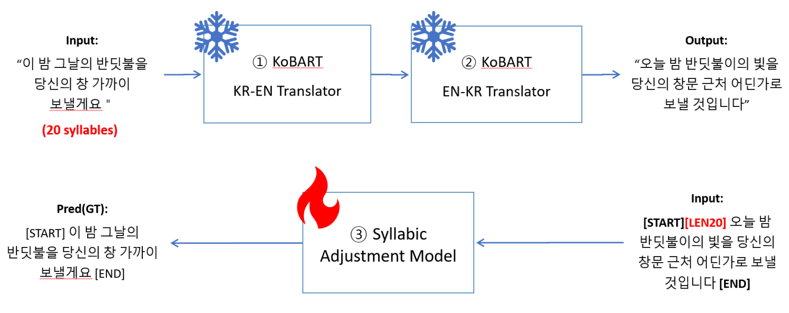

# LyriKOR
### LyriKOR: English to Korean Song Translation with Syllabic Alignment   
   
🔤2023-1 Natural language processing(COSE361) Term project in Korea Univ.   
✅**Achive Outstanding Projects (in Top-9 of 50 teams)**   
   
   
※ 저자들의 시험 기간 이슈로 일단은 미완성 레포입니다.   
> TODO:
> - evaluation.py commit
> - debugging
> - inference code for csv file
   
   
## Approach
   
Model structure overview diagram     
   
   
Model structure & How to train syllabic adjustment model     
   
   
Example of inference   
   
   
## Results
|원문|번역|
|--|--|
|I will always remember|항상 기억할께요|
|The day you kissed my lips|입맞춤 해주던|
|A hopeless romantic all my life|내 평생의 희망 없는 낭만|
|Surrounded by couples all the time|늘 커플에 둘러싸여 늘|
   
   
## Environment Setup
1. Install [KoBART](https://github.com/SKT-AI/KoBART)
	Colab에서 위 링크에 소개된 설치 방법(pip install ~)대로 KoBART를 설치할 경우 버전 충돌 때문에 제대로 설치되지 않는 문제 발생.    
	그러므로 pip을 이용해서 설치하는 대신,
	```
	git clone https://github.com/SKT-AI/KoBART
	```
	로 코드를 내려받은 후 `kobart` 디렉토리를 다음의 경로에 위치시켜 주세요.   
	Use the command above (git clone~ ) and put the `kobart` directory to the following path.
	```
	LyriKor
	└─ ...
	└─ Syllabic_adjustment
		└─ kobart
	└─ ...
	```
2. Install the other required modules   
	**! TODO: make requeirements.txt file !**   
	(colab에 깔려있는 module + transformer + boto3)   
	```
	pip install -r requirements.txt
	```
   
   
## How to Train the Syllabic Adjustment model
1. Prepare the Lyrics csv file of Korean songs.
	**It must have a column named `lyrics`.** For example:
	   
	| lyrics |
	| :--: |
	| 이 밤 그날의 반딧불을 당신의 ... |

2. Make train dataset file. Use the command below.
	```
	python preprocessing_for_train_data.py --lyrics_dataset_path='lyrics_file_name.csv' --save_dataset_path='train_dataset_file_name.csv'
	```
3. If there were no abnormalities, the train dataset file would have been created in the `dataset` directory. If you created a file in a different location, please move the file to the following location.
	```
	LyriKor
	└─ dataset
		└─ train_dataset_file_name.csv
	└─ ...
	```
4. Use the command to train the model.
	```
	cd Syllabic_adjustment
	python train.py --train_csv_file='train_dataset_file_name.csv'
	```
5. If you want to load the checkpoint of our model and continue to train, use `--checkpoint_path` option.
	```
	python train.py --checkpoint_path='path/to/load/model'
	```
7. If you want to tune the hyperparameter, use those options.
	```
	python train.py ...
					--batch_size (default=512)
					--epochs (default=15)
					--warmup_ratio (default=3e-5)
					--learning_rate (default=1.0)
	```


## How to Inference
1. By a single text line
	```
	python --input='input_text'
		   --checkpoint_path='path/to/load/model'
	```
2. By a csv file (multiple lines)
	**! TODO !**    
      
    
## Reference
[KoBART](https://github.com/SKT-AI/KoBART)   
[KoBART Question Generation](https://github.com/Seoneun/KoBART-Question-Generation)   
